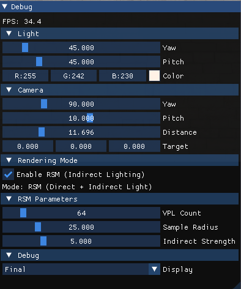

# Reflective Shadow Maps (RSM) 实现

## 项目简介

本项目是图形学大作业——Reflective Shadow Map (RSM) 的实现。RSM 是一种用于实时近似全局光照的技术，通过将 Shadow Map 中的每个像素视为虚拟点光源 (Virtual Point Light, VPL)，来计算一次反弹的间接光照。

## 算法原理

### RSM 论文核心思想

根据 Dachsbacher & Stamminger 2005 年的论文 "Reflective Shadow Maps"：

1. **基本思想**：将 Shadow Map 扩展为 Reflective Shadow Map，每个像素不仅存储深度，还存储世界空间位置、法线和反射光通量 (Flux)。

2. **数据存储**：每个 RSM 像素 p 存储：
   - 深度值 d_p
   - 世界空间位置 x_p
   - 法线 n_p
   - 反射光通量 Φ_p

3. **辐照度计算**：表面点 x（法线为 n）从像素光 p 接收的辐照度：
   ```
   E_p(x,n) = Φ_p * max(0, <n_p | x-x_p>) * max(0, <n | x_p-x>) / ||x-x_p||^4
   ```

4. **重要性采样**：使用极坐标采样来减少采样数量，采样密度随距离增加而减少：
   ```
   (s + r_max * ξ1 * sin(2πξ2), t + r_max * ξ1 * cos(2πξ2))
   ```
   权重补偿：ξ1²

5. **屏幕空间插值**：对于大多数像素，可以从低分辨率图像插值间接光照，只在边缘处进行完整计算。

## 参考实现分析

基于 GraphicAlgorithm/001_Reflective shadow map 项目的分析：

### 渲染管线

```
┌─────────────────────────────────────────────────────────────────────┐
│                        RSM 渲染管线                                  │
├─────────────────────────────────────────────────────────────────────┤
│                                                                      │
│  Pass 1: HalfCornellBoxGBufferPass (优先级1)                         │
│    └─→ 从摄像机视角渲染场景 → 生成 G-Buffer                           │
│         输出: Albedo, Normal (View), Position (View), Depth          │
│                                                                      │
│  Pass 2: RSMBufferPass (优先级2)                                     │
│    └─→ 从光源视角渲染场景 → 生成 RSM Buffer                           │
│         输出: Flux (VPL能量), Normal (View), Position (View)         │
│                                                                      │
│  Pass 3: ShadingWithRSMPass (优先级3)                                │
│    └─→ 使用 Compute Shader 计算直接光照 + 间接光照                    │
│         输出: 最终着色结果纹理                                        │
│                                                                      │
│  Pass 4: ScreenQuadPass (优先级4)                                    │
│    └─→ 将结果显示到屏幕 (带 Gamma 校正)                               │
└─────────────────────────────────────────────────────────────────────┘
```

### 关键参数

- RSM 分辨率: 256×256 (可调整)
- VPL 采样数量: 32
- 最大采样半径: 25 像素
- 光源: 方向光 (使用正交投影)

### 实现特点

1. **所有数据存储在相机视图空间**：RSM 从光源视角渲染，但存储的 Position 和 Normal 是相机视图空间下的值，简化后续着色计算。

2. **极坐标重要性采样**：采样密度随距离增加而减少，权重补偿 ξ1²。

3. **无间接光照遮挡**：与论文一致，不考虑 VPL 到接收点之间的遮挡（这是一个简化）。

## 本项目实现规划

### 技术栈

- OpenGL 4.3+ (支持 Compute Shader)
- GLFW (窗口管理)
- GLEW (OpenGL 扩展)
- GLM (数学库)
- ImGui (调试界面)
- tinyobjloader (OBJ 模型加载)

### 文件结构

```
src/impl/
├── main.cpp              # RSM 应用入口
├── rsm_app.hpp/cpp       # RSM 应用类
├── obj_loader.hpp/cpp    # OBJ 模型加载器
├── scene.hpp/cpp         # 场景管理
└── passes/
    ├── gbuffer_pass.hpp/cpp    # G-Buffer Pass
    ├── rsm_pass.hpp/cpp        # RSM Buffer Pass
    ├── shading_pass.hpp/cpp    # RSM 着色 Pass
    └── display_pass.hpp/cpp    # 最终显示 Pass

data/shaders/rsm/
├── gbuffer.vert          # G-Buffer 顶点着色器
├── gbuffer.frag          # G-Buffer 片段着色器
├── rsm_buffer.vert       # RSM Buffer 顶点着色器
├── rsm_buffer.frag       # RSM Buffer 片段着色器
├── rsm_shading.comp      # RSM 着色 Compute Shader
├── display.vert          # 显示顶点着色器
└── display.frag          # 显示片段着色器
```

### 实现步骤

1. **OBJ 模型加载器** - 使用 tinyobjloader 加载场景模型
2. **G-Buffer Pass** - 从摄像机视角渲染，输出 Albedo/Normal/Position/Depth
3. **RSM Buffer Pass** - 从光源视角渲染，输出 Flux/Normal/Position
4. **RSM Shading Pass** - Compute Shader 计算直接+间接光照
5. **Display Pass** - Gamma 校正并显示到屏幕
6. **ImGui 控制面板** - 调节光源、采样参数等

## 构建与运行

```bash
cmake -B build
cmake --build build
./build/src/impl/rsm
```

### ImGui面板参数
程序运行后，右上角将显示交互式控制面板，支持实时调节光源、相机、渲染模式及 RSM 参数

#### 光源控制（Light）
   - **Yaw / Pitch**：调整平行光方向
   - **Color**：修改光源颜色
#### 相机控制（Camera）
   - **Yaw / Pitch**：轨道相机水平/垂直旋转
   - **Distance**：相机到目标点的距离（最小值 0.1，避免视图矩阵崩溃）
   - **Target**：相机的世界坐标（微调）
#### 渲染模式（Rendering Mode）
   - **Enable RSM**:<br>
      开启：显示 *直接光 + 间接光*<br>
      关闭：仅显示 *直接光*
#### RSM 参数（RSM Parameters）
   - **VPL Count**：参与间接光计算的虚拟点光源数量
   - **Sample Radius**：RSM 采样半径
   - **Indirect Strength**：间接光强度增益（范围：0.1 ~ 20.0）<br>
   ⚠️ 当 RSM 关闭时，上述参数置灰无效。
#### 调试视图（Debug）
   切换显示模式，可视化中间缓冲区：
   - Final：最终渲染结果
   - Albedo / Normal / Position：G-Buffer 内容（相机视角）
   - RSM Flux / RSM Normal / RSM Position：RSM Buffer 内容（光源视角）

## 渲染结果

<table>
  <tr>
    <td align="center">关闭 RSM（仅直接光）</td>
    <td align="center">开启 RSM（含间接光）</td>
  </tr>
  <tr>
    <td align="center">
      
    </td>
    <td align="center">
      
    </td>
  </tr>
</table>

## 依赖

- CMake 3.15+
- C++17 编译器
- OpenGL 4.3+

## 总结与展望
本项目成功实现了基于 Reflective Shadow Maps 的实时全局光照技术，主要成果包括：
- **完整的 RSM 渲染管线**：实现了从 G-Buffer 生成、RSM 缓冲区构建、到最终着色的完整流程
- **间接光照计算**：通过虚拟点光源 (VPL) 实现了一次反弹的全局光照效果，使场景呈现出更真实的光照交互
- **高效的采样策略**：采用极坐标重要性采样，在保证视觉效果的前提下减少了计算开销
- **灵活的参数调节**：通过 ImGui 界面实时调整光源方向、VPL 数量、采样半径等参数

#### 渲染效果
从对比图可以看出，开启 RSM 后：
- 场景中的**颜色渗透**（Color Bleeding）效果明显
- 阴影区域不再是纯黑色，而是接收到柔和的**间接光照**
- 整体光照分布更加自然真实，增强了场景的**空间感和真实感**

### 当前局限

尽管实现了 RSM 的核心功能，项目仍存在一些局限性：
1. **单次反弹限制**：只计算了一次光线反弹的间接光照，对于需要多次反弹才能照亮的区域（如封闭房间内部），效果有限
2. **采样噪点**：由于 VPL 数量有限（通常 32-128 个），间接光照可能出现采样噪点，尤其在低采样数时较为明显
3. **仅支持方向光**：当前实现针对方向光源优化，对点光源和聚光灯的支持需要额外开发

### 未来改进方向

#### 短期优化
- **点光源支持**：不仅是平行光。
- **屏幕空间插值**：实现论文中提出的屏幕空间间接光照插值，对大部分像素使用低分辨率间接光照图，仅在边缘处完整计算，可大幅提升性能
- **动态场景优化**：针对动态物体，实现增量式 RSM 更新，避免每帧完全重建缓冲区
- **机器学习降噪**：探索基于深度学习的降噪方法（如 DLSS、AI Denoiser），进一步提升低采样数下的画质

### 结语

RSM 作为一种实时全局光照技术，在性能和效果之间取得了良好的平衡。本项目的实现证明了其在实时渲染中的可行性和有效性。虽然存在一些局限，但通过持续的技术改进和与其他方法的结合，RSM 仍具有广阔的应用前景，特别是在游戏、虚拟现实等需要实时全局光照的领域。

## 参考资料

1. Dachsbacher, C., & Stamminger, M. (2005). Reflective Shadow Maps. SIGGRAPH.
2. GraphicAlgorithm 项目: https://github.com/AngelMonica126/GraphicAlgorithm
